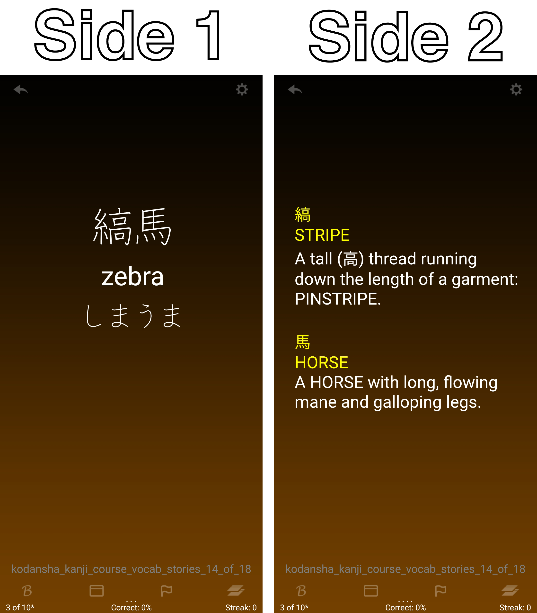

# Kanji Story Flashcards

Image: Screenshot from the Android app
[Flashcards Deluxe](http://orangeorapple.com/Flashcards/).
In Japanese, the characters for stripes (縞) and horse (馬)
together as a compound word means "Zebra" (i.e. "striped horse").
From this example, it's easy to see how knowing the individual meanings
of each character can be useful to memorise vocabulary.

## Description:
The Japanese language uses Chinese characters as part of their
written script, which they refer to as "kanji". For those new to
kanji, not knowing the meanings can make it hard to understand
vocabulary and remember how to write the characters. This script
uses kanji stories and vocabulary that I've put into separate Excel files
to generate an additional Excel file that can be imported into the
[Flashcards Deluxe](http://orangeorapple.com/Flashcards/) Android
app. This new card deck contains four sides (which can be customised within
the app): kanji, English meaning, kana, and kanji stories. This way,
we can learn Japanese vocabulary, and then use the kanji stories as a
prompt to help remember the vocabulary.
